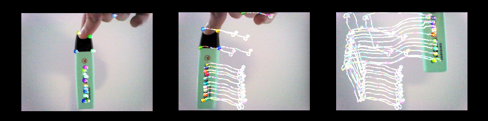

# Humanoid Robotic Systems tutorials

Code for the tutorials from the course Humanoid Robotic Systems at TUM. All the tasks were completed using the [NAO Robot](https://www.softbankrobotics.com/emea/en/nao) and ROS. Tutorials 3 and 4 were an introduction to computer vision using NAO's camera and tutorials 5, 6 and 7 implemented movement and other features.

<!---- [Tutorial 3: Vision – Feature extraction](tutorial_3)-->
- [Tutorial 4: Vision – Object detection, tracking, optical flow, and marker detection by ArUco](tutorial_4)  Sample (Optical Flow):  

- [Tutorial 5: Introduction to Joint Control on NAO](tutorial_5)  Sample (Reactive Head Tracking of an Aruco Marker):  

- [Tutorial 6: Introduction to Cartesian Control on NAO](tutorial_6)  Sample (Aruco Marker Tracking with Cartesian Motion Control):  

- [Tutorial 7: Walking, Talking, Blinking](tutorial_7)  Sample (Walking):  

